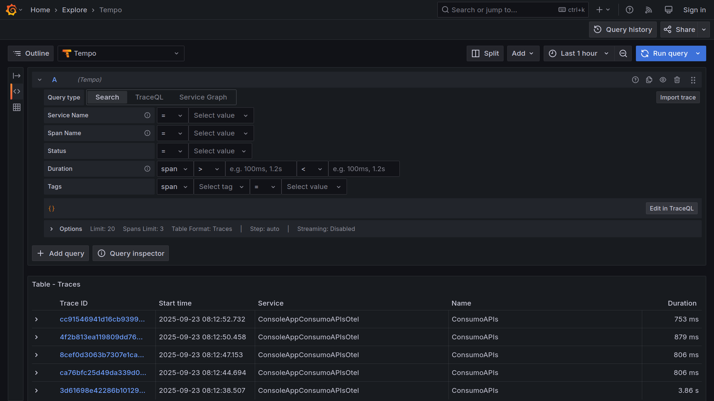
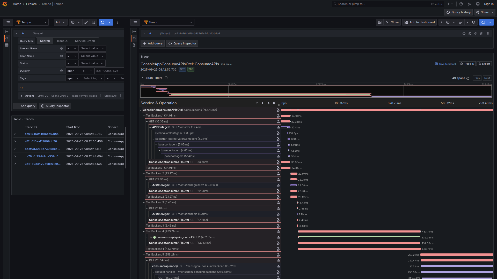
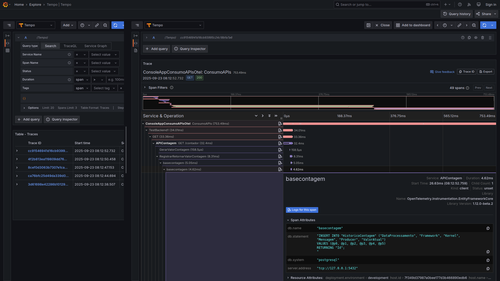

# dockercompose-opentelemetry-grafana-postgres-mysql-redis
Docker Compose + scripts para criação do ambiente de testes com os serviços de monitoramento do Grafana + OpenTelemetry e bases de dados do PostgreSQL, MySQL e Redis.

---

Repositórios com as aplicações utilizadas nos testes com tracing distribuído:
- [Console App de orquestração em .NET 9](https://github.com/renatogroffe/dotnet9-consoleapp-otel-grafana_consumoapis)
- [API que acessa PostgreSQL, MySQL e Redis - .NET 9 + ASP.NET Core](https://github.com/renatogroffe/aspnetcore9-otel-grafana-postgres-mysql-redis_apicontagem)
- [API REST criada com Node.js](https://github.com/renatogroffe/nodejs-otel_apiconsumobackend)
- [API REST criada com Java + Spring + Apache Camel](https://github.com/renatogroffe/java-spring-camel_apiconsumobackend)

Exemplos com geração de telemetria:

